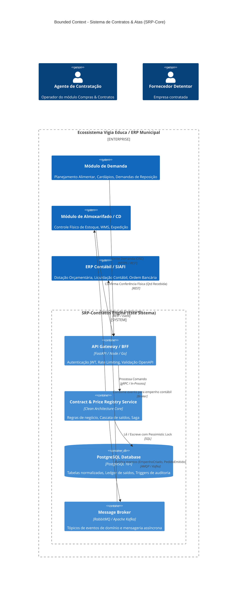
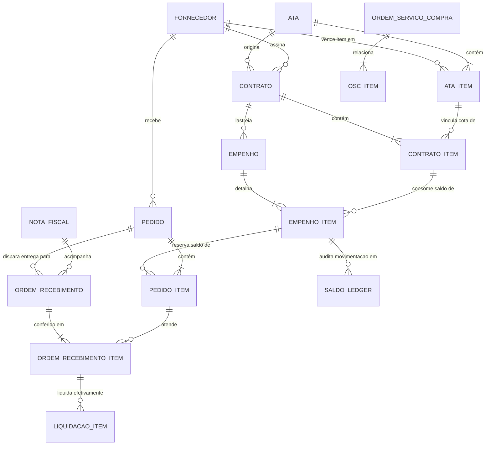
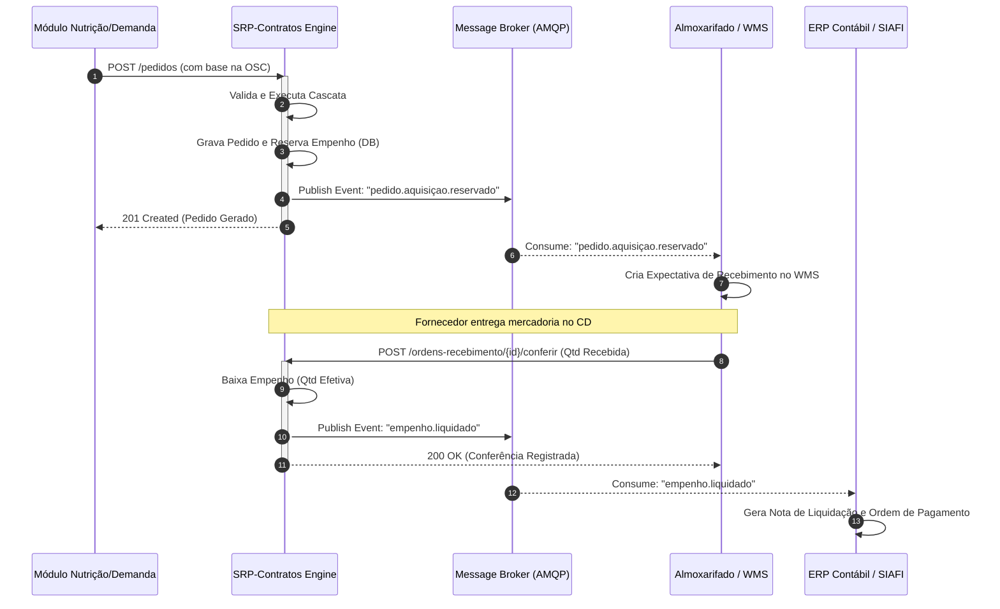

# Arquitetura de Referência: Sistema de Gestão de Atas de Registro de Preços e Contratos Administrativos (SRP-Contratos)
**Especificação Técnica, Bounded Context, Modelagem Relacional e Protocolos de Integração Inter-Ecossistemas**
*Em conformidade com a Lei Federal nº 14.133/2021 (Nova Lei de Licitações e Contratos Administrativos) e Padrões Enterprise de Arquitetura de Software*

---

## SUMÁRIO EXECUTIVO

1. **Visão Geral e Contexto de Negócio**
   - Fundamentação Legal (Lei 14.133/2021 & SRP)
   - Ciclo de Vida: Ata → Contrato → Empenho → Ordem de Fornecimento → Recebimento → Liquidação
   - Regras Centrais de Governança e Segregação de Funções (SoD)
2. **Arquitetura de Software & Bounded Context**
   - Delimitação do Domínio (DDD Bounded Context)
   - Padrão Arquitetural: Clean Architecture & Ports and Adapters (Hexagonal)
   - Padrões de Concorrência, Transações Distribuídas (Saga) e Idempotência
3. **Engenharia de Dados & Modelagem Relacional (PostgreSQL DDL)**
   - Diagrama Entidade-Relacionamento (ERD Lógico e Físico)
   - DDL Completo em ANSI PostgreSQL (Tabelas, FKs, CHECKs, Constraints)
   - Índices de Alta Performance e Estratégia de Particionamento
   - Views Materializadas e Ledger Auditável de Saldos (Event-Ledger Pattern)
4. **Motor de Saldos em Cascata (Cascading Balance Engine)**
   - Fórmulas Matemáticas e Estados de Saldo
   - Algoritmo Formal de Alocação e Reserva (FEFO Orçamentário)
   - Tratamento de Divergências Físico-Fiscais, Glosas e Reversões
5. **Especificação de APIs e Contratos de Comunicação (OpenAPI 3.1 Standard)**
   - Endpoints RESTful Principais (Catálogo, Atas, Contratos, Empenhos, Pedidos)
   - Esquemas JSON de Entrada/Saída e Padrão RFC 7807 (Problem Details)
   - Tratamento de Idempotência via Header `Idempotency-Key`
6. **Integração Assíncrona & Mensageria (Event-Driven Architecture)**
   - Catálogo de Eventos de Domínio (Domain Events via AMQP / Kafka)
   - Orquestração de Transações entre Ecossistemas (Orçamento, Estoque, Fiscal)
7. **Guia de Adoção e Acoplamento em Outros Ecossistemas**
   - Padrão Strangler Fig & Anti-Corruption Layer (ACL)
   - Mapeamento de Integração com Sistemas Legados / ERPs Governamentais (SIAFI, Betha, Fiorilli, SAP)
   - Segurança, Autenticação (OAuth2/mTLS) e Matriz de Controle de Acesso (RBAC)

---

## 1. VISÃO GERAL E CONTEXTO DE NEGÓCIO

### 1.1. Fundamentação Legal (Lei 14.133/2021)
O **Sistema de Registro de Preços (SRP)** é um procedimento especial de licitação que registra preços para contratações futuras e eventuais da Administração Pública.
No modelo arquitetural desta especificação, são modelados estritamente os papéis e prerrogativas da Lei 14.133/2021:
- **Órgão Gerenciador**: Responsável pela condução do certame, registro da ata e gestão do quantitativo global licitado.
- **Órgão Participante**: Integra a fase preparatória da licitação e detém uma cota do quantitativo total registrado na Ata.
- **Detentor da Ata (Fornecedor Vencedor)**: Empresa adjudicatária de cada lote/item, vinculada pelo compromisso de fornecimento pelo preço unitário adjudicado.
- **Contrato Administrativo**: Instrumento formal bilateral decorrente da Ata que vincula a obrigação específica com determinado fornecedor para um período delimitado.
- **Nota de Empenho (NE)**: Ato emanado por autoridade competente que cria para o Estado a obrigação de pagamento pendente ou não de implemento de condição (bloqueio do crédito orçamentário).

### 1.2. A Cadeia de Suprimentos Pública e Segregação de Funções (SoD)
A arquitetura impõe uma separação rígida de responsabilidades entre as partes do ecossistema:
1. **Demandante (Nutrição / Planejamento Escolar / Secretarias)**:
   - Gera a estimativa de consumo baseada no planejamento operacional (ex.: cardápios, alunos atendidos, per capita).
   - Emite a **Demanda de Suprimento (Ordem de Serviço de Compra - OSC)**. *Não escolhe fornecedor, não emite empenho e não gere saldos orçamentários.*
2. **Compras & Gestão Contratual (Este Módulo)**:
   - Detém a governança de Atas, Contratos, Empenhos e Fornecedores.
   - Converte OSCs em **Ordens de Fornecimento / Pedidos de Aquisição**, acionando o fornecedor adjudicatário vinculado ao item na Ata vigente.
   - Detém o saldo do empenho nas fases: `Empenhado` → `Reservado` → `Liquidado`.
   - Lança a **Ordem de Recebimento** e recebe as Notas Fiscais (DANFE/XML).
3. **Armazém Central / Almoxarifado / Estoque**:
   - Executa a conferência física e o confronto cego contra o DANFE da Ordem de Recebimento.
   - Devolve estritamente a **Quantidade Efetivamente Recebida (`qtd_recebida`)** e o status de aprovação ou divergência.
   - *Nunca tem acesso nem altera saldos contratuais ou empenhos.*

---

## 2. ARQUITETURA DE SOFTWARE & BOUNDED CONTEXT

### 2.1. Mapa de Contexto (Context Mapping - DDD)



### 2.2. Organização em Camadas (Hexagonal / Clean Architecture)
A implementação do módulo deve respeitar as seguintes camadas de isolamento:

1. **Domain Layer (Núcleo Puro)**:
   - Entidades: `AtaRegistroPreco`, `ItemAta`, `Contrato`, `TermoAditivo`, `Empenho`, `OrdemFornecimento (Pedido)`, `RegistroRecebimento`.
   - Value Objects: `CNPJ`, `PrecoUnitario`, `QuantidadeItem`, `DotacaoOrcamentaria`, `CodigoItemAta`.
   - Domain Services: `CalculadorSaldosCascataService`, `ValidadorVigenciaService`, `ValidadorAditivoContratualService`.
   - Repositories (Interfaces): `IAtaRepository`, `IContratoRepository`, `IEmpenhoRepository`, `IPedidoRepository`.
2. **Application Layer (Casos de Uso)**:
   - Commands: `PublicarAtaCommand`, `FirmarContratoCommand`, `EmitirEmpenhoCommand`, `AlocarDemandaEmPedidosCommand`, `ConfirmarRecebimentoFiscalCommand`.
   - Queries: `ConsultarSaldosAtaQuery`, `ObterExtratoEmpenhoQuery`, `RelatorioCumprimentoFornecedorQuery`.
   - Sagas: `AlocacaoCascataSagaManager` (orquestração transacional entre Ata, Contrato e Empenho).
3. **Infrastructure Layer (Adaptadores Secundários)**:
   - Persistência: SQLAlchemy / Prisma / Drizzle / Go Gorm conectados a PostgreSQL.
   - Messaging: Publisher/Subscriber para RabbitMQ ou Kafka com Outbox Pattern.
   - External ERP Connectors: Adapters SOAP/REST para SIAFI/SIAFEM ou sistemas contábeis públicos.
4. **Presentation / Interfaces (Adaptadores Primários)**:
   - REST Controllers documentados via OpenAPI 3.1.
   - Consumidores de Filas/Tópicos (Message Handlers).

---

## 3. ENGENHARIA DE DADOS & MODELAGEM RELACIONAL (POSTGRESQL DDL)

Abaixo encontra-se a modelagem de banco de dados completa, projetada para integridade relacional absoluta, com chaves substitutas UUID v4, precisão decimal estrita (`NUMERIC(15,4)` para evitar arredondamentos indevidos de miligramas ou centavos), histórico de alterações (Event Sourcing parcial para saldos) e constraints corporativas.



### 3.1. Script DDL Completo em ANSI PostgreSQL (v14+)

```sql
-- ============================================================================
-- ARQUITETURA DE BANCO DE DADOS: MÓDULO SRP-CONTRATOS
-- DIALETO: PostgreSQL 14+
-- ENCODING: UTF-8
-- ============================================================================

CREATE EXTENSION IF NOT EXISTS "uuid-ossp";
CREATE EXTENSION IF NOT EXISTS "pgcrypto";

-- Esquema isolado para acoplamento limpo
CREATE SCHEMA IF NOT EXISTS srp_contratos;
SET search_path TO srp_contratos, public;

-- ----------------------------------------------------------------------------
-- ENUMS DO DOMÍNIO
-- ----------------------------------------------------------------------------
CREATE TYPE status_ata_enum AS ENUM (
    'RASCUNHO', 'EM_HOMOLOGACAO', 'VIGENTE', 'SUSPENSA', 'CANCELADA', 'EXPIRADA'
);

CREATE TYPE modalidade_licitacao_enum AS ENUM (
    'PREGAO_ELETRONICO', 'CONCORRENCIA', 'CHAMADA_PUBLICA_PNAE', 'DISPENSA_LEI_14133', 'INEXIGIBILIDADE'
);

CREATE TYPE status_contrato_enum AS ENUM (
    'MINUTA', 'AGUARDANDO_ASSINATURA', 'VIGENTE', 'ADITADO', 'RESCINDIDO', 'CONCLUIDO'
);

CREATE TYPE status_empenho_enum AS ENUM (
    'RASCUNHO', 'SOLICITADO', 'EMITIDO', 'REFORCADO', 'ANULADO_PARCIAL', 'ANULADO_TOTAL', 'LIQUIDADO'
);

CREATE TYPE status_pedido_enum AS ENUM (
    'RESERVADO', 'ENVIADO_FORNECEDOR', 'CONFIRMADO_FORNECEDOR', 'EM_TRANSITO', 'RECEBIDO_PARCIAL', 'RECEBIDO_TOTAL', 'CANCELADO'
);

CREATE TYPE status_ordem_recebimento_enum AS ENUM (
    'PENDENTE_CONFERENCIA', 'CONFERIDA_COM_DIVERGENCIA', 'CONFERIDA_OK', 'REJEITADA_TOTAL', 'LIQUIDADA'
);

CREATE TYPE tipo_lancamento_ledger_enum AS ENUM (
    'CREDITO_INICIAL', 'CONTRATACAO', 'EMPENHO', 'RESERVA_PEDIDO', 'CANCELAMENTO_PEDIDO', 'LIQUIDACAO_RECEBIMENTO', 'ESTORNO_DIVERGENCIA', 'REAJUSTE_ADITIVO'
);

-- ----------------------------------------------------------------------------
-- 1. FORNECEDORES (Cadastro Corporativo Integrável)
-- ----------------------------------------------------------------------------
CREATE TABLE srp_contratos.fornecedores (
    id UUID PRIMARY KEY DEFAULT gen_random_uuid(),
    codigo_integracao VARCHAR(64) UNIQUE, -- Chave externa do ERP / Receita Federal
    cnpj_cpf VARCHAR(18) NOT NULL UNIQUE,
    razao_social VARCHAR(255) NOT NULL,
    nome_fantasia VARCHAR(255),
    tipo_fornecedor VARCHAR(32) NOT NULL DEFAULT 'EMPRESA_CONVENCIONAL', -- 'AGRICULTOR_FAMILIAR', 'COOPERATIVA', 'EMPRESA_CONVENCIONAL'
    inscricao_estadual VARCHAR(32),
    email_pedidos VARCHAR(255) NOT NULL,
    telefone VARCHAR(32),
    endereco_completo JSONB NOT NULL DEFAULT '{}'::jsonb,
    dados_bancarios JSONB NOT NULL DEFAULT '[]'::jsonb,
    ativo BOOLEAN NOT NULL DEFAULT TRUE,
    created_at TIMESTAMPTZ NOT NULL DEFAULT clock_timestamp(),
    updated_at TIMESTAMPTZ NOT NULL DEFAULT clock_timestamp()
);

-- ----------------------------------------------------------------------------
-- 2. ATAS DE REGISTRO DE PREÇOS (SRP)
-- ----------------------------------------------------------------------------
CREATE TABLE srp_contratos.atas (
    id UUID PRIMARY KEY DEFAULT gen_random_uuid(),
    numero_ata VARCHAR(32) NOT NULL,              -- ex: 'ATA-018/2026'
    ano INTEGER NOT NULL,
    processo_administrativo VARCHAR(64) NOT NULL, -- ex: '034.819/2025-37'
    edital_numero VARCHAR(32) NOT NULL,           -- ex: 'Edital 103/2025'
    modalidade modalidade_licitacao_enum NOT NULL DEFAULT 'PREGAO_ELETRONICO',
    orgao_gerenciador VARCHAR(255) NOT NULL,      -- ex: 'SELC - Superintendência de Registro de Preços'
    objeto_resumido TEXT NOT NULL,
    data_assinatura DATE NOT NULL,
    data_inicio_vigencia DATE NOT NULL,
    data_fim_vigencia DATE NOT NULL,
    permite_carona BOOLEAN NOT NULL DEFAULT FALSE,
    limite_adesao_carona_percentual NUMERIC(5,2) DEFAULT 50.00, -- Limite art. 86 Lei 14.133
    status status_ata_enum NOT NULL DEFAULT 'VIGENTE',
    metadata JSONB DEFAULT '{}'::jsonb,
    created_at TIMESTAMPTZ NOT NULL DEFAULT clock_timestamp(),
    updated_at TIMESTAMPTZ NOT NULL DEFAULT clock_timestamp(),
    CONSTRAINT chk_vigencia_ata CHECK (data_fim_vigencia >= data_inicio_vigencia),
    CONSTRAINT uk_ata_numero_ano UNIQUE (numero_ata, ano)
);

-- ----------------------------------------------------------------------------
-- 3. ITENS REGISTRADOS NA ATA (Item x Preço Homologado x Fornecedor Vencedor)
-- ----------------------------------------------------------------------------
CREATE TABLE srp_contratos.ata_itens (
    id UUID PRIMARY KEY DEFAULT gen_random_uuid(),
    ata_id UUID NOT NULL REFERENCES srp_contratos.atas(id) ON DELETE RESTRICT,
    fornecedor_id UUID NOT NULL REFERENCES srp_contratos.fornecedores(id) ON DELETE RESTRICT,
    numero_item INTEGER NOT NULL,                 -- ex: Item 01
    codigo_catalogo_externo VARCHAR(64),          -- SKU / ID do alimento ou produto central
    descricao_detalhada TEXT NOT NULL,
    marca_homologada VARCHAR(128),
    unidade_medida VARCHAR(16) NOT NULL,          -- 'kg', 'dz', 'L', 'un'
    quantidade_licitada NUMERIC(15,4) NOT NULL,   -- Teto total registrado para o item
    preco_unitario_registrado NUMERIC(15,4) NOT NULL,
    cota_tipo VARCHAR(32) NOT NULL DEFAULT 'PRINCIPAL', -- 'PRINCIPAL', 'RESERVADA_ME_EPP', 'EXCLUSIVA'
    ativo BOOLEAN NOT NULL DEFAULT TRUE,
    created_at TIMESTAMPTZ NOT NULL DEFAULT clock_timestamp(),
    updated_at TIMESTAMPTZ NOT NULL DEFAULT clock_timestamp(),
    CONSTRAINT chk_qtd_licitada_pos CHECK (quantidade_licitada > 0),
    CONSTRAINT chk_preco_unit_pos CHECK (preco_unitario_registrado > 0),
    CONSTRAINT uk_ata_item_numero UNIQUE (ata_id, numero_item)
);

-- ----------------------------------------------------------------------------
-- 4. ÓRGÃOS PARTICIPANTES DA ATA (Detentores de Cotas Licitadas)
-- ----------------------------------------------------------------------------
CREATE TABLE srp_contratos.ata_participantes (
    id UUID PRIMARY KEY DEFAULT gen_random_uuid(),
    ata_id UUID NOT NULL REFERENCES srp_contratos.atas(id) ON DELETE RESTRICT,
    codigo_orgao VARCHAR(64) NOT NULL,            -- ex: 'SEMED', 'SAS', 'SESAU'
    nome_orgao VARCHAR(255) NOT NULL,
    eh_gerenciador BOOLEAN NOT NULL DEFAULT FALSE,
    created_at TIMESTAMPTZ NOT NULL DEFAULT clock_timestamp(),
    CONSTRAINT uk_ata_orgao UNIQUE (ata_id, codigo_orgao)
);

-- ----------------------------------------------------------------------------
-- 5. CONTRATOS ADMINISTRATIVOS
-- ----------------------------------------------------------------------------
CREATE TABLE srp_contratos.contratos (
    id UUID PRIMARY KEY DEFAULT gen_random_uuid(),
    numero_contrato VARCHAR(32) NOT NULL,         -- ex: 'CT-2026/045'
    ano INTEGER NOT NULL,
    ata_id UUID NOT NULL REFERENCES srp_contratos.atas(id) ON DELETE RESTRICT,
    fornecedor_id UUID NOT NULL REFERENCES srp_contratos.fornecedores(id) ON DELETE RESTRICT,
    orgao_contratante VARCHAR(64) NOT NULL,       -- ex: 'SEMED'
    processo_formalizacao VARCHAR(64) NOT NULL,
    data_assinatura DATE NOT NULL,
    data_inicio_vigencia DATE NOT NULL,
    data_fim_vigencia DATE NOT NULL,
    valor_total_contratado NUMERIC(15,4) NOT NULL DEFAULT 0.0000,
    status status_contrato_enum NOT NULL DEFAULT 'VIGENTE',
    gestor_contrato_nome VARCHAR(255),
    gestor_contrato_matricula VARCHAR(64),
    fiscal_contrato_nome VARCHAR(255),
    fiscal_contrato_matricula VARCHAR(64),
    metadata JSONB DEFAULT '{}'::jsonb,
    created_at TIMESTAMPTZ NOT NULL DEFAULT clock_timestamp(),
    updated_at TIMESTAMPTZ NOT NULL DEFAULT clock_timestamp(),
    CONSTRAINT chk_vigencia_contrato CHECK (data_fim_vigencia >= data_inicio_vigencia),
    CONSTRAINT uk_contrato_numero_ano UNIQUE (numero_contrato, ano)
);

-- ----------------------------------------------------------------------------
-- 6. ITENS DO CONTRATO (Subconjunto firmado da Ata)
-- ----------------------------------------------------------------------------
CREATE TABLE srp_contratos.contrato_itens (
    id UUID PRIMARY KEY DEFAULT gen_random_uuid(),
    contrato_id UUID NOT NULL REFERENCES srp_contratos.contratos(id) ON DELETE CASCADE,
    ata_item_id UUID NOT NULL REFERENCES srp_contratos.ata_itens(id) ON DELETE RESTRICT,
    quantidade_contratada NUMERIC(15,4) NOT NULL,
    preco_unitario_aplicado NUMERIC(15,4) NOT NULL, -- Herdado da ata, salvo em caso de apostilamento
    valor_total_item NUMERIC(15,4) GENERATED ALWAYS AS (quantidade_contratada * preco_unitario_aplicado) STORED,
    created_at TIMESTAMPTZ NOT NULL DEFAULT clock_timestamp(),
    updated_at TIMESTAMPTZ NOT NULL DEFAULT clock_timestamp(),
    CONSTRAINT chk_qtd_contratada_pos CHECK (quantidade_contratada > 0),
    CONSTRAINT uk_contrato_ata_item UNIQUE (contrato_id, ata_item_id)
);

-- ----------------------------------------------------------------------------
-- 7. NOTAS DE EMPENHO (Crédito Orçamentário Vinculado ao Contrato)
-- ----------------------------------------------------------------------------
CREATE TABLE srp_contratos.empenhos (
    id UUID PRIMARY KEY DEFAULT gen_random_uuid(),
    numero_empenho VARCHAR(64) NOT NULL UNIQUE,   -- ex: '2026NE000189'
    contrato_id UUID NOT NULL REFERENCES srp_contratos.contratos(id) ON DELETE RESTRICT,
    dotacao_orcamentaria VARCHAR(128) NOT NULL,   -- Classificação funcional-programática / PTRES
    fonte_recurso VARCHAR(32) NOT NULL,           -- ex: '1.500.1001' (Recursos Próprios / FNDE / PNAE)
    data_emissao DATE NOT NULL,
    valor_total_empenhado NUMERIC(15,4) NOT NULL DEFAULT 0.0000,
    status status_empenho_enum NOT NULL DEFAULT 'EMITIDO',
    origem_solicitacao_id UUID,                   -- Se gerado automaticamente por cascata
    created_at TIMESTAMPTZ NOT NULL DEFAULT clock_timestamp(),
    updated_at TIMESTAMPTZ NOT NULL DEFAULT clock_timestamp()
);

-- ----------------------------------------------------------------------------
-- 8. ITENS DA NOTA DE EMPENHO
-- ----------------------------------------------------------------------------
CREATE TABLE srp_contratos.empenho_itens (
    id UUID PRIMARY KEY DEFAULT gen_random_uuid(),
    empenho_id UUID NOT NULL REFERENCES srp_contratos.empenhos(id) ON DELETE CASCADE,
    contrato_item_id UUID NOT NULL REFERENCES srp_contratos.contrato_itens(id) ON DELETE RESTRICT,
    quantidade_empenhada NUMERIC(15,4) NOT NULL,
    preco_unitario NUMERIC(15,4) NOT NULL,
    valor_total_empenhado NUMERIC(15,4) GENERATED ALWAYS AS (quantidade_empenhada * preco_unitario) STORED,
    created_at TIMESTAMPTZ NOT NULL DEFAULT clock_timestamp(),
    CONSTRAINT chk_qtd_empenhada_pos CHECK (quantidade_empenhada > 0),
    CONSTRAINT uk_empenho_contrato_item UNIQUE (empenho_id, contrato_item_id)
);

-- ----------------------------------------------------------------------------
-- 9. PEDIDOS DE AQUISIÇÃO / ORDENS DE FORNECIMENTO (OF)
-- ----------------------------------------------------------------------------
CREATE TABLE srp_contratos.pedidos_aquisicao (
    id UUID PRIMARY KEY DEFAULT gen_random_uuid(),
    numero_pedido VARCHAR(32) NOT NULL UNIQUE,    -- ex: 'OF-2026/00142'
    fornecedor_id UUID NOT NULL REFERENCES srp_contratos.fornecedores(id) ON DELETE RESTRICT,
    demanda_origem_ref VARCHAR(64),               -- ID da OSC (Nutrição / Estoque)
    data_emissao TIMESTAMPTZ NOT NULL DEFAULT clock_timestamp(),
    prazo_limite_entrega DATE NOT NULL,
    local_entrega_destino VARCHAR(255) NOT NULL DEFAULT 'Estoque Central / CD',
    status status_pedido_enum NOT NULL DEFAULT 'RESERVADO',
    observacoes TEXT,
    created_at TIMESTAMPTZ NOT NULL DEFAULT clock_timestamp(),
    updated_at TIMESTAMPTZ NOT NULL DEFAULT clock_timestamp()
);

-- ----------------------------------------------------------------------------
-- 10. ITENS DO PEDIDO (Vínculo e Bloqueio Firme no Empenho)
-- ----------------------------------------------------------------------------
CREATE TABLE srp_contratos.pedido_itens (
    id UUID PRIMARY KEY DEFAULT gen_random_uuid(),
    pedido_id UUID NOT NULL REFERENCES srp_contratos.pedidos_aquisicao(id) ON DELETE CASCADE,
    empenho_item_id UUID NOT NULL REFERENCES srp_contratos.empenho_itens(id) ON DELETE RESTRICT,
    quantidade_pedida NUMERIC(15,4) NOT NULL,
    preco_unitario NUMERIC(15,4) NOT NULL,
    valor_total_item NUMERIC(15,4) GENERATED ALWAYS AS (quantidade_pedida * preco_unitario) STORED,
    created_at TIMESTAMPTZ NOT NULL DEFAULT clock_timestamp(),
    CONSTRAINT chk_qtd_pedida_pos CHECK (quantidade_pedida > 0)
);

-- ----------------------------------------------------------------------------
-- 11. DOCUMENTOS FISCAIS (Notas Fiscais de Entrada)
-- ----------------------------------------------------------------------------
CREATE TABLE srp_contratos.notas_fiscais (
    id UUID PRIMARY KEY DEFAULT gen_random_uuid(),
    chave_acesso_nfe CHAR(44) NOT NULL UNIQUE,
    numero_nota VARCHAR(32) NOT NULL,
    serie VARCHAR(8) NOT NULL,
    fornecedor_id UUID NOT NULL REFERENCES srp_contratos.fornecedores(id) ON DELETE RESTRICT,
    data_emissao TIMESTAMPTZ NOT NULL,
    data_recebimento_fiscal TIMESTAMPTZ DEFAULT clock_timestamp(),
    valor_total_produtos NUMERIC(15,4) NOT NULL,
    valor_total_nota NUMERIC(15,4) NOT NULL,
    xml_conteudo TEXT,                            -- Armazenamento para auditoria
    status VARCHAR(32) NOT NULL DEFAULT 'REGISTRADA', -- 'REGISTRADA', 'EM_CONFERENCIA', 'CONFERIDA', 'LIQUIDADA', 'REJEITADA'
    created_at TIMESTAMPTZ NOT NULL DEFAULT clock_timestamp()
);

-- ----------------------------------------------------------------------------
-- 12. ORDENS DE RECEBIMENTO (Interface Compras <-> Almoxarifado/CD)
-- ----------------------------------------------------------------------------
CREATE TABLE srp_contratos.ordens_recebimento (
    id UUID PRIMARY KEY DEFAULT gen_random_uuid(),
    numero_ordem VARCHAR(32) NOT NULL UNIQUE,     -- ex: 'REC-2026/00091'
    pedido_id UUID NOT NULL REFERENCES srp_contratos.pedidos_aquisicao(id) ON DELETE RESTRICT,
    nota_fiscal_id UUID REFERENCES srp_contratos.notas_fiscais(id) ON DELETE SET NULL,
    status status_ordem_recebimento_enum NOT NULL DEFAULT 'PENDENTE_CONFERENCIA',
    data_abertura TIMESTAMPTZ NOT NULL DEFAULT clock_timestamp(),
    data_conferencia TIMESTAMPTZ,
    responsavel_conferencia VARCHAR(255),
    termo_recebimento_definitivo TEXT,
    created_at TIMESTAMPTZ NOT NULL DEFAULT clock_timestamp(),
    updated_at TIMESTAMPTZ NOT NULL DEFAULT clock_timestamp()
);

-- ----------------------------------------------------------------------------
-- 13. ITENS CONFERIDOS NA ORDEM DE RECEBIMENTO
-- ----------------------------------------------------------------------------
CREATE TABLE srp_contratos.ordem_recebimento_itens (
    id UUID PRIMARY KEY DEFAULT gen_random_uuid(),
    ordem_recebimento_id UUID NOT NULL REFERENCES srp_contratos.ordens_recebimento(id) ON DELETE CASCADE,
    pedido_item_id UUID NOT NULL REFERENCES srp_contratos.pedido_itens(id) ON DELETE RESTRICT,
    quantidade_esperada NUMERIC(15,4) NOT NULL,
    quantidade_recebida NUMERIC(15,4) NOT NULL DEFAULT 0.0000,
    quantidade_divergencia NUMERIC(15,4) GENERATED ALWAYS AS (quantidade_recebida - quantidade_esperada) STORED,
    justificativa_divergencia TEXT,
    aprovado_qualidade BOOLEAN NOT NULL DEFAULT TRUE,
    created_at TIMESTAMPTZ NOT NULL DEFAULT clock_timestamp(),
    CONSTRAINT chk_qtd_rec_non_neg CHECK (quantidade_recebida >= 0)
);

-- ----------------------------------------------------------------------------
-- 14. LEDGER DE AUDITORIA DE SALDOS (Event-Sourcing / Razão Financeiro-Físico)
-- Registra todas as mutações atômicas de saldo para auditoria do TCE / CGU.
-- ----------------------------------------------------------------------------
CREATE TABLE srp_contratos.saldo_ledger (
    id BIGSERIAL PRIMARY KEY,
    transacao_id UUID NOT NULL DEFAULT gen_random_uuid(),
    tipo_evento tipo_lancamento_ledger_enum NOT NULL,
    ata_item_id UUID REFERENCES srp_contratos.ata_itens(id),
    contrato_item_id UUID REFERENCES srp_contratos.contrato_itens(id),
    empenho_item_id UUID REFERENCES srp_contratos.empenho_itens(id),
    pedido_item_id UUID REFERENCES srp_contratos.pedido_itens(id),
    delta_quantidade NUMERIC(15,4) NOT NULL,      -- Positivo ou negativo
    delta_valor NUMERIC(15,4) NOT NULL,
    usuario_ou_sistema VARCHAR(128) NOT NULL,
    payload_snapshot JSONB,
    created_at TIMESTAMPTZ NOT NULL DEFAULT clock_timestamp()
);

-- ----------------------------------------------------------------------------
-- ÍNDICES ESTRATÉGICOS DE ALTA PERFORMANCE
-- ----------------------------------------------------------------------------
CREATE INDEX idx_ata_itens_ata_fornecedor ON srp_contratos.ata_itens(ata_id, fornecedor_id);
CREATE INDEX idx_contrato_itens_contrato ON srp_contratos.contrato_itens(contrato_id);
CREATE INDEX idx_empenho_itens_empenho ON srp_contratos.empenho_itens(empenho_id);
CREATE INDEX idx_pedidos_status_entrega ON srp_contratos.pedidos_aquisicao(status, prazo_limite_entrega);
CREATE INDEX idx_ordem_rec_status ON srp_contratos.ordens_recebimento(status);
CREATE INDEX idx_ledger_empenho ON srp_contratos.saldo_ledger(empenho_item_id);
CREATE INDEX idx_ledger_ata ON srp_contratos.saldo_ledger(ata_item_id);
```

### 3.2. Views de Alta Performance para Saldos em Tempo Real

```sql
-- ----------------------------------------------------------------------------
-- VIEW MATERIALIZADA / DINÂMICA: SALDO DE ATAS (Teto x Contratado x Remanescente)
-- ----------------------------------------------------------------------------
CREATE OR REPLACE VIEW srp_contratos.vw_saldos_ata AS
SELECT 
    ai.id AS ata_item_id,
    a.numero_ata,
    a.ano AS ata_ano,
    a.status AS ata_status,
    f.id AS fornecedor_id,
    f.razao_social AS fornecedor_nome,
    ai.numero_item,
    ai.codigo_catalogo_externo,
    ai.descricao_detalhada,
    ai.unidade_medida,
    ai.preco_unitario_registrado,
    ai.quantidade_licitada,
    COALESCE(SUM(ci.quantidade_contratada), 0) AS quantidade_comprometida_contratos,
    (ai.quantidade_licitada - COALESCE(SUM(ci.quantidade_contratada), 0)) AS saldo_remanescente_ata,
    ROUND((ai.quantidade_licitada - COALESCE(SUM(ci.quantidade_contratada), 0)) * ai.preco_unitario_registrado, 2) AS saldo_valor_remanescente
FROM srp_contratos.ata_itens ai
JOIN srp_contratos.atas a ON a.id = ai.ata_id
JOIN srp_contratos.fornecedores f ON f.id = ai.fornecedor_id
LEFT JOIN srp_contratos.contrato_itens ci ON ci.ata_item_id = ai.id
GROUP BY ai.id, a.id, f.id;

-- ----------------------------------------------------------------------------
-- VIEW DINÂMICA: SALDO DO EMPENHO (Empenhado x Reservado x Liquidado x Livre)
-- ----------------------------------------------------------------------------
CREATE OR REPLACE VIEW srp_contratos.vw_saldos_empenho AS
WITH entregas_conferidas AS (
    SELECT 
        pi.id AS pedido_item_id,
        COALESCE(SUM(ori.quantidade_recebida), 0) AS total_recebido_conferido
    FROM srp_contratos.pedido_itens pi
    JOIN srp_contratos.ordens_recebimento_itens ori ON ori.pedido_item_id = pi.id
    JOIN srp_contratos.ordens_recebimento ord ON ord.id = ori.ordem_recebimento_id
    WHERE ord.status IN ('CONFERIDA_OK', 'LIQUIDADA', 'CONFERIDA_COM_DIVERGENCIA')
    GROUP BY pi.id
),
resumo_pedidos AS (
    SELECT 
        pi.empenho_item_id,
        COALESCE(SUM(pi.quantidade_pedida), 0) AS qtd_total_pedida,
        COALESCE(SUM(ec.total_recebido_conferido), 0) AS qtd_total_liquidada,
        -- Reserva ativa = pedidos ainda pendentes de entrega
        COALESCE(SUM(GREATEST(0, pi.quantidade_pedida - COALESCE(ec.total_recebido_conferido, 0))), 0) AS qtd_reservada_ativa
    FROM srp_contratos.pedido_itens pi
    LEFT JOIN entregas_conferidas ec ON ec.pedido_item_id = pi.id
    GROUP BY pi.empenho_item_id
)
SELECT 
    ei.id AS empenho_item_id,
    e.numero_empenho,
    c.numero_contrato,
    f.razao_social AS fornecedor_nome,
    ai.descricao_detalhada AS produto,
    ai.unidade_medida,
    ei.preco_unitario,
    ei.quantidade_empenhada,
    COALESCE(rp.qtd_reservada_ativa, 0) AS quantidade_reservada,
    COALESCE(rp.qtd_total_liquidada, 0) AS quantidade_liquidada,
    (ei.quantidade_empenhada - COALESCE(rp.qtd_reservada_ativa, 0) - COALESCE(rp.qtd_total_liquidada, 0)) AS saldo_livre_empenho,
    ROUND((ei.quantidade_empenhada - COALESCE(rp.qtd_reservada_ativa, 0) - COALESCE(rp.qtd_total_liquidada, 0)) * ei.preco_unitario, 2) AS saldo_livre_valor
FROM srp_contratos.empenho_itens ei
JOIN srp_contratos.empenhos e ON e.id = ei.empenho_id
JOIN srp_contratos.contrato_itens ci ON ci.id = ei.contrato_item_id
JOIN srp_contratos.contratos c ON c.id = ci.contrato_id
JOIN srp_contratos.ata_itens ai ON ai.id = ci.ata_item_id
JOIN srp_contratos.fornecedores f ON f.id = ai.fornecedor_id
LEFT JOIN resumo_pedidos rp ON rp.empenho_item_id = ei.id;
```

---

## 4. MOTOR DE SALDOS EM CASCATA (CASCADING BALANCE ENGINE)

### 4.1. Fundamentação Matemática dos Saldos
A integridade dos saldos governa toda a contratação e aquisição do ecossistema.

$$\text{SaldoAta}(item) = Q_{\text{licitada}}(item) - \sum Q_{\text{contratada}}(item)$$

$$\text{SaldoContrato}(item) = Q_{\text{contratada}}(item) - \sum Q_{\text{empenhada}}(item)$$

$$\text{SaldoLivreEmpenho}(item) = Q_{\text{empenhada}}(item) - \left( Q_{\text{reservada}}(item) + Q_{\text{liquidada}}(item) \right)$$

$$\text{SaldoAEntregar}(pedido\_item) = Q_{\text{pedida}} - \sum_{\text{ordens\_conferidas}} Q_{\text{recebida}}$$

### 4.2. Algoritmo de Alocação e Geração em Cascata
Ao converter uma solicitação de compra de quantidade $Q$ de um item $P$:

```
ALGORITMO AlocarDemandaEmCascata(produto P, quantidadeSolicitada Q):
    Entrada: Código do Produto P, Quantidade Necessária Q
    Saída: PlanoAlocacao (Reservas, Rascunhos de Empenho, Rascunhos de Contrato, Bloqueio)

    1. Localizar AtaItem ativo para P na Ata Vigente do Órgão.
       Se não encontrar: Retornar ERRO("Produto não possui ata homologada vigente").
       Identificar FornecedorDetentor F e PreçoUnitario U.

    2. Inicializar:
       falta = Q
       Plano.ReservasEmpenho = []
       Plano.NovosEmpenhosSugeridos = []
       Plano.NovosContratosSugeridos = []
       Plano.QtdSemSaldo = 0

    3. [NÍVEL 1: EMPENHOS EXISTENTES (FEFO Orçamentário)]
       Buscar EmpenhoItens de F para P com SaldoLivre > 0, ordenados por DataEmissao ASC.
       Para cada empenho_item:
           Se falta <= 0: Interromper laço.
           usar = MIN(empenho_item.SaldoLivre, falta)
           Plano.ReservasEmpenho.adicionar(empenho_item.Id, usar)
           falta = falta - usar

    4. [NÍVEL 2: SALDO DE CONTRATO (Geração de Novo Empenho)]
       Se falta > 0:
           Buscar ContratoItem ativo para P e F.
           Se ContratoItem existe e ContratoItem.Saldo > 0:
               usar = MIN(ContratoItem.Saldo, falta)
               Plano.NovosEmpenhosSugeridos.adicionar(ContratoItem.Id, usar, U)
               falta = falta - usar

    5. [NÍVEL 3: SALDO DE ATA (Geração de Contrato + Empenho)]
       Se falta > 0:
           saldoAta = AtaItem.SaldoRemanescente
           Se saldoAta > 0:
               usar = MIN(saldoAta, falta)
               Plano.NovosContratosSugeridos.adicionar(AtaItem.Id, usar, U)
               Plano.NovosEmpenhosSugeridos.adicionar(NovoContratoRef, usar, U)
               falta = falta - usar

    6. [NÍVEL 4: INSUFICIÊNCIA TOTAL DE SALDO]
       Se falta > 0:
           Plano.QtdSemSaldo = falta
           Plano.Aprovavel = FALSO
       Senão:
           Plano.Aprovavel = VERDADEIRO

    7. Retornar PlanoAlocacao.
```

### 4.3. Tratamento de Concorrência e Bloqueio Pessimista
Para garantir que requisições concorrentes não criem **sobre-alocação** de ata ou de empenho, o motor executa o comando com bloqueio no nível de linha:

```sql
-- Executado dentro de uma transação SERIALIZABLE ou com SELECT FOR UPDATE
SELECT id, quantidade_licitada
FROM srp_contratos.ata_itens
WHERE id = :ata_item_id
FOR UPDATE; -- Bloqueia a linha até o commit da reserva/contrato
```

---

## 5. ESPECIFICAÇÃO DE APIS E CONTRATOS DE COMUNICAÇÃO (OPENAPI 3.1)

O ecossistema expõe uma interface RESTful padronizada com payloads em JSON e cabeçalhos de controle.

### 5.1. Matriz de Endpoints do Serviço

| Método | Caminho | Descrição |
|---|---|---|
| `GET` | `/api/v1/atas` | Lista atas com filtros de status, vigência e fornecedor |
| `GET` | `/api/v1/atas/{id}/saldos` | Retorna o extrato de saldos por item da ata |
| `POST` | `/api/v1/contratos` | Cria um contrato a partir do saldo remanescente da ata |
| `POST` | `/api/v1/empenhos` | Emite uma nova nota de empenho vinculada a um contrato |
| `POST` | `/api/v1/pedidos/planejar-alocacao` | Simula a cascata para uma demanda de compras |
| `POST` | `/api/v1/pedidos` | Cria a Ordem de Fornecimento efetivando a reserva de saldos |
| `POST` | `/api/v1/ordens-recebimento/{id}/conferir` | Registra o resultado da conferência física do armazém |
| `POST` | `/api/v1/ordens-recebimento/{id}/liquidar` | Executa a liquidação contábil definitiva |

### 5.2. Exemplos de Payloads (JSON Schemas)

#### POST `/api/v1/pedidos/planejar-alocacao`
**Request:**
```json
{
  "origemDemandaRef": "OSC-2026/00482",
  "itens": [
    {
      "codigoProduto": "ALIM-001-ARROZ",
      "quantidadeSolicitada": 2500.00,
      "unidadeMedida": "kg"
    }
  ]
}
```

**Response (200 OK):**
```json
{
  "sucesso": true,
  "podeEfetivarSemBloqueio": true,
  "itensAlocados": [
    {
      "codigoProduto": "ALIM-001-ARROZ",
      "quantidadeSolicitada": 2500.00,
      "fornecedor": {
        "id": "a5e8f411-92b0-4f51-b850-8b9a67d0e123",
        "razaoSocial": "Polaris Comércio de Alimentos Ltda",
        "cnpj": "60.947.677/0001-63"
      },
      "precoUnitario": 4.50,
      "valorEstimado": 11250.00,
      "estrategiaAlocacao": {
        "reservasEmpenhoExistente": [
          {
            "empenhoId": "c1f10e4a-4d7a-40a1-a477-94d8ec5b0811",
            "numeroEmpenho": "2026NE000142",
            "quantidadeAlocada": 1500.00
          }
        ],
        "novoEmpenhoSugerido": {
          "contratoId": "b2c3d4e5-f6a7-4819-90b1-123456789abc",
          "numeroContrato": "CT-2026/018",
          "quantidadeDisponivel": 1000.00,
          "quantidadeRequerida": 1000.00,
          "dotacaoSugerida": "12.306.0001.2004"
        },
        "novoContratoSugerido": null,
        "quantidadeNaoAtendida": 0.00
      }
    }
  ]
}
```

#### POST `/api/v1/ordens-recebimento/{id}/conferir`
**Header:** `Idempotency-Key: 7c9e6679-7425-40de-944b-e07fc1f90ae7`  
**Request:**
```json
{
  "responsavelConferencia": "Carlos Eduardo (Almoxarife Central)",
  "dataConferencia": "2026-09-22T08:30:00Z",
  "chaveAcessoNfe": "50260960947677000163550010000189121000458129",
  "itens": [
    {
      "pedidoItemId": "d4e5f6a7-b8c9-4012-91a2-345678901def",
      "quantidadeRecebida": 2450.00,
      "quantidadeEsperada": 2500.00,
      "divergencia": -50.00,
      "motivoDivergencia": "50kg avariados por umidade no transporte (devolvidos ao motorista)",
      "aprovadoQualidade": true
    }
  ]
}
```

**Efeito Transacional da Conferência com Divergência:**
1. Os 2.450 kg recebidos são registrados como elegíveis para liquidação imediata.
2. Os 50 kg faltantes **não são liquidados**; o sistema estorna a reserva de 50 kg no empenho, fazendo com que este saldo volte a ficar **livre** para uma nova requisição ou cancelamento.
3. É aberta uma ocorrência formal de descumprimento parcial para o fornecedor.

---

## 6. INTEGRAÇÃO ASSÍNCRONA & MENSAGERIA (EVENT-DRIVEN)

Para comunicação desacoplada com módulos externos (WMS, Portal da Transparência, ERP Contábil e Nutrição), o sistema adota publicação de eventos de domínio padronizados via CloudEvents.



### 6.1. Tópicos e Esquemas de Mensageria

1. **`srp.ata.publicada.v1`**: Emitido quando uma nova ata passa a vigorar.
2. **`srp.contrato.assinado.v1`**: Emitido na assinatura de contrato ou aditivo.
3. **`srp.empenho.emitido.v1`**: Notifica a contabilidade da emissão do empenho.
4. **`srp.pedido.emitido.v1`**: Notifica o WMS e envia cópia digital ao fornecedor.
5. **`srp.entrega.conferida.v1`**: Disparado após a conferência cega do almoxarifado.
6. **`srp.empenho.liquidado.v1`**: Notifica o setor de pagamentos e a prestação de contas.

---

## 7. GUIA DE ADOÇÃO E ACOPLAMENTO EM OUTROS ECOSSISTEMAS

### 7.1. Padrão Anti-Corruption Layer (ACL)
Ao integrar este motor de Atas e Contratos com um ecossistema preexistente (seja um ERP legado, uma plataforma de saúde ou educação):
1. **Não permita acesso direto às tabelas de saldos**: Todas as consultas e mutações devem ocorrer via API REST ou chamadas de serviço de domínio.
2. **Tradução de Identificadores (External ID Mapping)**: A tabela `fornecedores` e `ata_itens` possui campos `codigo_integracao` e `codigo_catalogo_externo` exatamente para preservar a chave primária do sistema hospedeiro sem forçar mudanças de esquemas legados.
3. **Isolamento de Transações via Saga**: Quando o ERP externo forçar a criação de empenhos em seu próprio banco de dados, utilize a saga orquestrada:
   - `Passo 1`: SRP-Contratos reserva o saldo com status `PENDING`.
   - `Passo 2`: RPC chama o ERP externo para emitir a Nota de Empenho formal.
   - `Passo 3a`: Se sucesso, confirma a reserva no SRP-Contratos.
   - `Passo 3b`: Se falha/timeout, dispara a transação de compensação estornando a reserva.

### 7.2. Matriz de Segurança e Controle de Acesso (RBAC)

| Perfil / Papel | Atas | Contratos | Empenhos | Pedidos | Conf. Física | Liquidação |
|---|---|---|---|---|---|---|
| **Comprador / Gestor Contratual** | Cria / Edita | Cria / Edita | Emite | Emite | Apenas Visualiza | Executa |
| **Nutricionista / Demandante** | Apenas Visualiza | Apenas Visualiza | Sem Acesso | Solicita | Sem Acesso | Sem Acesso |
| **Almoxarife / Fiscal Técnico** | Apenas Visualiza | Apenas Visualiza | Sem Acesso | Acompanha | **Executa** | Sem Acesso |
| **Auditor / Controle Interno** | Apenas Visualiza | Apenas Visualiza | Apenas Visualiza | Apenas Visualiza | Apenas Visualiza | Apenas Visualiza |
| **Fornecedor (Portal Extranet)** | Consulta Própria | Consulta Próprio | Consulta Próprio | Recebe / Aceita | Sem Acesso | Visualiza Pagamentos |

---

## 8. CHECKLIST DE VALIDAÇÃO DE CONFORMIDADE PARA PRODUÇÃO

- [ ] Todas as quantidades e preços operam sob o tipo de dados `NUMERIC(15,4)`.
- [ ] Chaves de Idempotência (`Idempotency-Key`) implementadas em todas as operações de escrita.
- [ ] Bloqueio pessimista (`FOR UPDATE`) ativo durante o cálculo e reserva da cascata.
- [ ] Tabela `saldo_ledger` registrando snapshots de auditoria em cada transação de saldo.
- [ ] Segregação de funções estrita: o perfil de Estoque não possui privilégios de escrita sobre empenhos ou contratos.
- [ ] Limites legais de aditamento (+25% / -25%) validados programaticamente pelo serviço de domínio.

---
*Documento de Especificação Técnica Arquitetural — Padrão Enterprise Vigia Educa / SRP-Contratos v3.0.*
