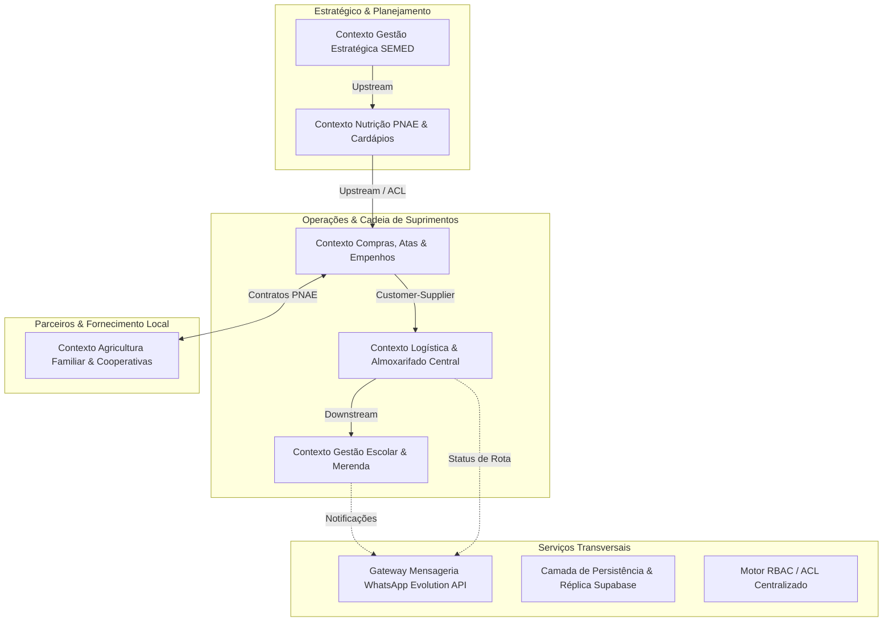

# 🍽️ SUALE — Sistema de Gestão da Alimentação Escolar
### SEMED · Prefeitura Municipal de Campo Grande / MS
**Versão Atual:** `v3.1.0-release` · **Arquitetura:** Domain-Driven Design (DDD) & Least-Privilege RBAC

---

## 🎯 Visão Geral do Sistema

O **SUALE** é o sistema corporativo e integrado de gestão, fiscalização e inteligência da alimentação escolar de Campo Grande (MS), cobrindo a totalidade da rede municipal de ensino (REME) e atendendo com rigor técnico às diretrizes do **PNAE (Programa Nacional de Alimentação Escolar)** e da **Lei Federal nº 11.947/2009** (mínimo de 30% da agricultura familiar).

O sistema abrange desde o planejamento nutricional, atas de registro de preços e empenhos até a logística WMS do depósito central, rotas dos motoristas com assinatura digital, portal cívico de transparência para pais e alunos e controle de recepção de merenda nas unidades escolares.

---

## 🏗️ Arquitetura & Bounded Contexts (DDD)

O sistema é modularizado em Bounded Contexts claramente delimitados (conforme documentado em [`docs/CONTEXT_MAPPING_DDD_RBAC.md`](docs/CONTEXT_MAPPING_DDD_RBAC.md)):



### Principais Inovações da v3.1.0:
1. **Motor Centralizado de RBAC / ACL (`js/modules/rbac.js`):**
   - Controle estrito de acesso (*least privilege*) baseado em papéis: Gestor Geral, Nutricionista PNAE, Direção Escolar, Operador WMS/Depósito, Motorista de Entrega, Setor de Compras, Cooperativa e Agricultor Familiar.
   - API de verificação fluente: `SUALE_RBAC.can(role, action, resource)` e `SUALE_RBAC.guard()`.
2. **Gateway WhatsApp Evolution API (`js/modules/messaging_evolution.js`):**
   - Notificações ativas de chegada de entrega escolar, alertas de avaria/ocorrência em rotas, avisos de ordens de compra a fornecedores e relatórios de vencimento de estoque perecível.
   - Suporte a modo Sandbox/Simulação transparente e higienização no formato E.164 (`+55 67 ...`).
   - Carimbo de data/hora no fuso horário oficial de Mato Grosso do Sul (`America/Campo_Grande`, UTC-4).
3. **Engenharia de Dados & Migração SQL de Alta Performance (`migrations/`):**
   - Índices B-Tree cobrindo 100% das Foreign Keys e consultas frequentes.
   - Índices GIN em colunas JSONB (`orders.items` e `empenhos.itens`) acelerando buscas de lotes e itens.
   - Fallback resiliente no cliente Supabase (`db.js`) com tolerância a falhas e timeout de 800ms.
4. **Acessibilidade WCAG 2.2 AA & Portal Cívico Ipê:**
   - Contornos de foco explícitos (`:focus-visible`) e respeito às preferências de movimento (`prefers-reduced-motion`).
   - Portal público de transparência das escolas piloto da SEMED Campo Grande.

---

## 🚀 Quick Start

### Pré-requisitos
- [Node.js 18+](https://nodejs.org/) (inclui `npx`)
- Git

### Instalação e Execução Local
```bash
# 1. Acesse o diretório do projeto
cd "d:\Projetos\vigia educa"

# 2. Instale dependências e navegadores do Playwright
npm install
npx playwright install chromium

# 3. Configure as variáveis de ambiente (opcional, possui fallback para simulação local)
cp .env.example .env

# 4. Inicie o servidor local
npm start
# O sistema estará acessível em: http://localhost:8080
```

---

## 🧪 Bateria de Testes Automatizados (Playwright)

A integridade do sistema é garantida por **77 testes automatizados de ponta a ponta (E2E)** cobrindo todos os fluxos críticos e todas as telas ativas:

```bash
# Executar a bateria completa de 77 testes (Headless)
npx playwright test

# Executar com navegador visível
npm run test:headed

# Executar com a interface gráfica do Playwright
npm run test:ui

# Executar suites por perfil específico:
npm run test:gestor         # Perfil Gestor SEMED
npm run test:nutricionista  # Perfil Nutricionista PNAE
npm run test:escola         # Perfil Unidades Escolares
npm run test:cooperativa    # Perfil Cooperativas Agrícolas
npm run test:agricultor     # Perfil Agricultores Familiares

# Executar suite de RBAC e Mensageria (Fase 3):
npx playwright test tests/fase3-rbac-messaging.spec.js

# Smoke Test em 100% das telas cadastradas (137 telas):
npx playwright test tests/smoke-renderers.spec.js
```

### Matriz de Cobertura de Testes:

| Perfil / Módulo | Telas Mapeadas | Testes Playwright | Escopo Coberto |
|-----------------|----------------|-------------------|----------------|
| **Login & Cívico Ipê** | 2 | 10 | Autenticação institucional, seleção de perfil, portal cívico de transparência, logout |
| **Gestor SEMED** | 10 | 15 | Dashboard executivo, KPIs de merenda, atas de registro de preços, IA de previsão |
| **Nutricionista PNAE** | 10 | 11 | Fichas técnicas, cardápios PNAE, restrições alimentares, cálculo de desperdício |
| **Unidades Escolares** | 9 | 10 | Recepção de mercadorias, conferência cega, estoque local, consumo diário |
| **Cooperativas** | 11 | 12 | Produtores associados, rotas de coleta, contratos PNAE, cronogramas de safra |
| **Agricultor Familiar** | 8 | 9 | Produção local, remessas, pedidos e calendário de colheita |
| **Logística WMS & Motorista** | 11 | 5 | Inventário central, separação por lote, registro de ocorrências na rota |
| **RBAC & Mensageria WhatsApp** | — | 4 | Autorizações e negações por Bounded Context, sanitização E.164, templates PNAE |
| **Smoke Renderers** | **137** | 1 | Renderização dinâmica de 100% das telas de `PAGE_RENDERERS` sem erros |
| **Total** | **137 telas** | **77 testes** | **100% Green (0 falhas)** |

---

## 📁 Estrutura de Diretórios

```
vigia educa/
├── docs/                                    ← Documentação técnica e arquitetural
│   ├── CONTEXT_MAPPING_DDD_RBAC.md          ← Mapa de contextos DDD, ACL e matriz de permissões
│   └── DIFFERENTIAL_SECURITY_REVIEW.md      ← Auditoria diferencial de segurança
├── js/
│   ├── modules/                             ← Módulos especializados
│   │   ├── rbac.js                          ← Motor RBAC/ACL tipado e Bounded Contexts
│   │   ├── messaging_evolution.js           ← Gateway de mensageria WhatsApp Evolution API
│   │   ├── gestor.js                        ← Módulo executivo SEMED
│   │   ├── nutricao.js                      ← Fichas técnicas e cardápios PNAE
│   │   ├── estoque.js                       ← Almoxarifado central e WMS
│   │   ├── motorista.js                     ← App de entrega e ocorrências
│   │   ├── escolas.js                       ← Gestão escolar da merenda
│   │   ├── compras.js                       ← Contratos, atas e empenhos
│   │   ├── colaboradores.js                 ← Cooperativas e produtores rurais
│   │   └── admin.js                         ← Configurações administrativas
│   └── core_hub.js                          ← Barramento de estado e roteador SPA
├── migrations/                              ← Pacote de migração SQL de alta performance
│   ├── 001_performance_indexes_and_jsonb_gin.sql  ← Índices B-Tree e GIN (JSONB)
│   ├── 001_performance_indexes_rollback.sql       ← Script de reversão limpa
│   ├── 002_verification_queries.sql               ← Auditoria com EXPLAIN ANALYZE
│   └── README.md                            ← Guia de aplicação zero-downtime
├── tests/                                   ← Suites de testes E2E Playwright
│   ├── fase3-rbac-messaging.spec.js         ← Testes unitários/E2E de RBAC e Mensageria
│   ├── smoke-renderers.spec.js              ← Validação de 137 telas ativas
│   ├── login.spec.js                        ← Login institucional e Portal Cívico
│   ├── gestor.spec.js                       ← Testes do perfil Gestor
│   ├── nutricionista.spec.js                ← Testes do perfil Nutricionista
│   ├── escola.spec.js                       ← Testes do perfil Escola
│   ├── cooperativa.spec.js                  ← Testes do perfil Cooperativa
│   ├── agricultor.spec.js                   ← Testes do perfil Agricultor
│   ├── motorista.spec.js                    ← Testes de rota e ocorrências
│   └── helpers.js                           ← Utilitários de navegação e fixtures
├── db.js                                    ← Camada de integração resiliente Supabase
├── alimentos.js                             ← Base de dados nutricionais TACO / IBGE
├── ai_cardapio_engine.js                    ← Motor de IA para recomendação de cardápios
├── sprint_abc.js                            ← Curva ABC de insumos e contratos
├── styles.css                               ← Design system Cívico Ipê (WCAG 2.2 AA)
├── index.html                               ← Shell principal da aplicação SPA
├── .env.example                             ← Template documentado de variáveis de ambiente
├── playwright.config.js                     ← Configuração do executor Playwright
└── README.md                                ← Este documento
```

---

## 🔒 Segurança, Governança & Conformidade

- **Governança de Credenciais:** Nenhuma chave com permissão de escrita ou administrativa está exposta. `.gitignore` reforçado bloqueia commits acidentais de arquivos `.env`, chaves `.pem`/`.key` ou arquivos de credenciais.
- **Fail-Closed RBAC:** Negação de acesso por padrão para qualquer rota ou ação fora da matriz de permissões.
- **Auditoria de Migrações:** Scripts SQL idempotentes com comandos `IF NOT EXISTS` e procedimentos documentados de rollback.
- **Trava de Segurança de Produção:** Nenhuma versão é promovida ao ambiente produtivo sem homologação prévia no ambiente local e validação explícita do gestor.

---

## 🏛️ Créditos e Responsabilidade Institucional

- **Órgão Responsável:** SEMED — Secretaria Municipal de Educação de Campo Grande / MS
- **Supervisão Técnica:** SUALE — Superintendência de Alimentação Escolar
- **Marco Regulatório:** Programa Nacional de Alimentação Escolar (PNAE) · FNDE · Lei Federal nº 11.947/2009
