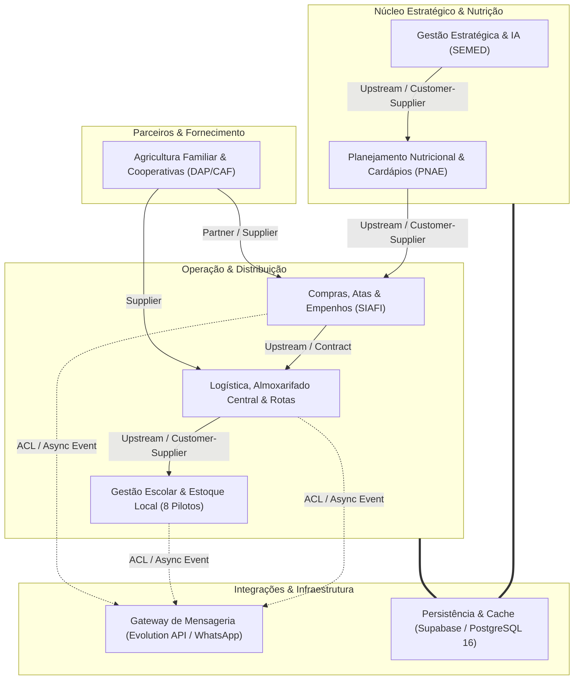

# Mapeamento de Contextos DDD, Controle de Acesso (RBAC) e Mensageria

**Sistema:** SUALE — Sistema de Gestão da Alimentação Escolar  
**Órgão:** SEMED · Campo Grande · MS  
**Arquitetura:** Domain-Driven Design (DDD) com Bounded Contexts, RBAC Determinístico e Integração WhatsApp via Evolution API  
**Versão:** 3.1.0 (Fase 3)  

---

## 1. Mapa de Contextos Delimitados (DDD Context Map)

O sistema foi estruturado em contextos delimitados com fronteiras claras, desacoplando o núcleo de regras de negócio de alimentação escolar das integrações periféricas e canais de mensageria externa.

### Detalhamento das Relações entre Contextos:

| Upstream (Fornecedor) | Downstream (Consumidor) | Padrão DDD | Descrição |
| :--- | :--- | :--- | :--- |
| **Nutrição PNAE** | **Compras & Contratos** | *Customer-Supplier* | A definição dos cardápios gera a demanda estimada de insumos para empenhos e compras. |
| **Compras & Contratos** | **Logística / WMS** | *Conformist / Contract* | O Almoxarifado Central recebe os lotes com base nos empenhos e notas fiscais emitidas. |
| **Logística / WMS** | **Gestão Escolar** | *Customer-Supplier* | O Almoxarifado despacha rotas de entrega para as unidades escolares piloto. |
| **Cooperativas / AF** | **Logística / WMS** | *Supplier* | Cooperativas entregam produtos hortifrutigranjeiros diretamente nas escolas ou na central. |
| **Operações Gerais** | **Evolution API (WhatsApp)** | *Anti-Corruption Layer (ACL)* | O módulo `messaging_evolution.js` isola o domínio das variações de API do WhatsApp. |

---

## 2. Matriz de Controle de Acesso (RBAC & ACL)

Implementada no módulo [`js/modules/rbac.js`](../js/modules/rbac.js), aplicando o princípio de menor privilégio (*Least Privilege*):

| Recurso | Gestor SEMED | Nutricionista | Escola (Diretor/Estoque) | Central Estoque | Motorista | Compras / Contratos | Cooperativa / Agricultor |
| :--- | :---: | :---: | :---: | :---: | :---: | :---: | :---: |
| **Dashboard** | `read` | `read` | `read` | `read` | `read` | `read` | `read` |
| **Escolas Piloto** | `read`, `write` | `read` | `read` (própria) | `read` | — | — | — |
| **Atas & Empenhos** | `read`, `approve` | — | — | — | — | `read`, `write` | `read` (própria) |
| **Cardápios & Fichas** | `read` | `read`, `write`, `approve` | `read` | — | — | — | — |
| **Estoque Escolar** | `read` | `read` | `read`, `write` | — | — | — | — |
| **Estoque Central** | `read` | — | — | `read`, `write` | — | — | — |
| **Rotas & Entregas** | `read` | — | `confirm` | `read`, `dispatch` | `read`, `sign` | — | `read` |
| **Ocorrências** | `read` | — | — | `read` | `create` | — | — |
| **IA de Previsão** | `read`, `execute` | — | — | — | — | — | — |
| **Mensageria WhatsApp**| `dispatch` | `alert` | `alert` | `alert` | `alert` | `alert` | — |

---

## 3. Arquitetura do Barramento de Mensageria (Evolution API)

O serviço em [`js/modules/messaging_evolution.js`](../js/modules/messaging_evolution.js) fornece integração assíncrona com os seguintes eventos:

1. **Alerta de Início de Deslocamento para Entrega**:
   - *Gatilho:* Motorista dá partida na entrega da escola.
   - *Destinatário:* Diretor(a) e responsável da despensa da escola.
   - *Conteúdo:* Identificação do motorista, pedido, horário previsto no fuso de Campo Grande (`America/Campo_Grande`).
2. **Notificação de Ocorrência na Rota**:
   - *Gatilho:* Pneu furado, via interditada ou avaria de carga reportada pelo motorista.
   - *Destinatário:* Central de Distribuição SEMED.
3. **Aviso de Ordem de Fornecimento PNAE**:
   - *Gatilho:* Emissão de empenho/OS para fornecedor da Agricultura Familiar.
   - *Destinatário:* Presidente ou operador da Cooperativa rural.
4. **Alerta de Risco de Validade de Estoque**:
   - *Gatilho:* Item com validade inferior a 5 dias detectado no estoque da escola.
   - *Destinatário:* Nutricionista responsável para priorização no cardápio semanal.

### Resiliência & Fallback (Sandbox Mode)
- Quando as variáveis de ambiente `EVOLUTION_API_URL` e `EVOLUTION_API_KEY` não estiverem configuradas, o módulo entra automaticamente em **Modo Sandbox**, exibindo os disparos no console estruturado e alimentando o histórico de notificações em memória/localStorage sem falhar a aplicação cliente.
